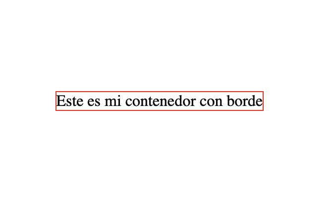
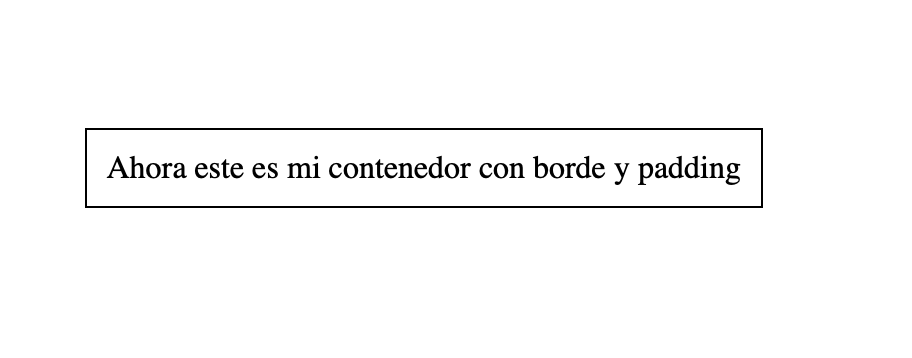
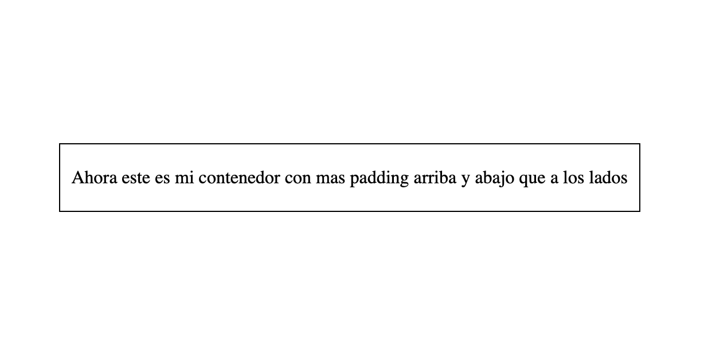

## Bordes

El atributo `border` en CSS se utiliza para agregar un borde a un elemento HTML, como un contenedor o una imagen. El borde se coloca alrededor del elemento y se puede personalizar con diferentes estilos, anchuras y colores.

Para utilizar el atributo `border`, se debe especificar el ancho del borde, el estilo y el color en una sola línea de código. Por ejemplo, para agregar un borde negro sólido de 1 píxel de ancho a un elemento HTML con la clase "mi-contenedor", se puede usar el siguiente código CSS:


1. Border sólido de color rojo con un ancho de 1px:

```CSS
.mi-contenedor {
  border: 1px solid red;
}
```
En el primer ejemplo, estamos definiendo un borde sólido de color negro con un ancho de 1px en un elemento `div`. La propiedad `border` tiene cuatro valores: ancho, estilo, color y radio. En este caso, estamos utilizando `1px` como ancho, `solid` como estilo, y `black` como color.



2. Border en forma de esquina redondeada con un ancho de `2px`:
   
```CSS
div {
  border: 2px dashed #f44336;
  border-radius: 10px;
}
```
En el segundo ejemplo, estamos creando un borde con un ancho de `2px` en forma de esquina redondeada. Para lograr esto, estamos utilizando la propiedad `border-radius` para definir el radio de las esquinas. La propiedad `border` también tiene cuatro valores en este caso: ancho, estilo, color y radio. Estamos utilizando `2px` como ancho, `dashed` como estilo, y `#f44336 como color`.


## Márgenes

Los márgenes son los espacios en blanco que rodean un elemento y se utilizan para crear un espacio entre los elementos y los bordes de los contenedores.

Los márgenes pueden ser ajustados mediante la propiedad margin. Esta propiedad tiene cuatro valores que se pueden establecer en píxeles (px), porcentajes (%) o ems (em), y corresponden a la separación superior, derecha, inferior e izquierda del elemento con relación a sus elementos adyacentes.

Por ejemplo, si queremos establecer un margen de 10 píxeles en todos los lados de un elemento, podemos usar la siguiente regla de CSS:

```css
.elemento {
  margin: 10px;
}
```

También es posible especificar valores individuales para cada uno de los cuatro lados, utilizando la sintaxis `margin-top`, `margin-right`, `margin-bottom` y `margin-left`. Por ejemplo:

```css
.elemento {
  margin-top: 20px;
  margin-right: 10px;
  margin-bottom: 30px;
  margin-left: 15px;
}
```

Ejemplo 1:
En este ejemplo, la clase `.box` tiene un ancho y alto de 200px, con un fondo de color azul claro. El `margin` se establece en 20px, lo que significa que habrá un espacio de 20px entre los límites de la caja y cualquier elemento que esté fuera de ella.

```CSS
.box {
  background-color: lightblue;
  width: 200px;
  height: 200px;
  margin: 20px; /* Aplica un margin de 20px a los cuatro lados de la caja */
}
```

Ejemplo 2:

En este ejemplo, la clase .box tiene el mismo ancho, alto y fondo que en el ejemplo anterior. Sin embargo, en lugar de aplicar un margin de 20px a los cuatro lados, se aplican diferentes márgenes a la parte superior e inferior de la caja. Esto significa que habrá un espacio de 20px en la parte superior y 40px en la parte inferior de la caja.

```CSS
.box {
  background-color: lightblue;
  width: 200px;
  height: 200px;
  margin-top: 20px; /* Aplica un margin de 20px en la parte superior de la caja */
  margin-bottom: 40px; /* Aplica un margin de 40px en la parte inferior de la caja */
}
```

## Padding

La propiedad padding se utiliza para agregar espacio entre el contenido de un elemento y su borde. Esta propiedad puede tener cuatro valores (izquierda, arriba, derecha, abajo) para especificar diferentes espacios de relleno para cada lado del elemento.

Por ejemplo, si quisieras agregar un espacio de relleno de 10 píxeles alrededor de todo el contenido de un elemento con un borde de 1 píxel, podrías hacerlo de la siguiente manera:

```css
.elemento {
  border: 1px solid black; /* Agrega un borde de 1px */
  padding: 10px; /* Agrega un espacio de relleno de 10px en todos los lados */
}
```



También se pueden especificar valores individuales para el relleno (padding) en CSS. Para hacer esto, se utiliza la propiedad padding junto con la propiedad correspondiente de cada uno de los cuatro lados: padding-top, padding-right, padding-bottom y padding-left.

Por ejemplo, si se quisiera aplicar un relleno de 20 píxeles en la parte superior y en la parte inferior de un elemento, y 10 píxeles en los lados derecho e izquierdo, se podría usar la siguiente regla de CSS:

```css
.elemento {
  border: 1px solid black; /* Agrega un borde de 1px */
  padding-top: 20px;
  padding-right: 10px;
  padding-bottom: 20px;
  padding-left: 10px;
}
```



También es posible utilizar la propiedad padding y especificar los valores en el orden de las agujas del reloj, empezando por la parte superior. Por ejemplo:

```css
.mi-elemento {
  padding: 20px 10px 20px 10px;
}
```

## Fondos

Se pueden agregar fondos a elementos HTML utilizando la propiedad background. Con esta propiedad se pueden establecer varios valores, como colores sólidos, imágenes de fondo, gradientes, etc.

Por ejemplo, para establecer un color de fondo sólido en un elemento, se puede utilizar la siguiente sintaxis:


```css
background-color: red;
```

Para agregar una imagen de fondo, se puede utilizar la propiedad background-image junto con la URL de la imagen:

```css
background-image: url("fondo.png");
```


Además, se pueden ajustar diferentes aspectos del fondo, como la posición, la repetición, el tamaño y el desplazamiento utilizando otras propiedades como background-position, background-repeat, background-size y background-attachment.

Por ejemplo, para establecer una imagen de fondo que se repita horizontalmente y se fije en su posición mientras se desplaza la página, se podría utilizar el siguiente código:

```css
background-image: url("imagen.png");
background-repeat: repeat-x;
background-attachment: fixed;
```


Ejemplo:

```html
<!DOCTYPE html>
<html>
<head>
	<title>Ejemplo de background en CSS</title>
	<style>
		#mi-elemento {
			background: #f2f2f2;
		}
	</style>
</head>
<body>
	<div id="mi-elemento">
		<p>Este es un ejemplo de cambio de color de fondo con CSS.</p>
	</div>
</body>
</html>
```
